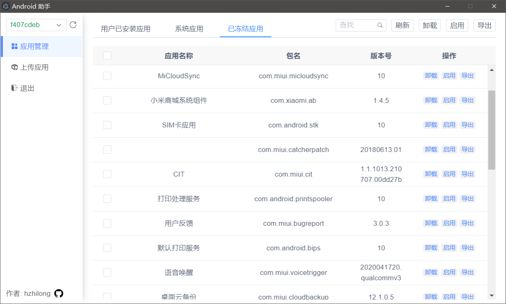

# 安卓助手
软件说明：可在PC上对安卓设备中的应用进行管理，包括：卸载、导出、冻结、安装。

使用vue+electron开发软件。仅使用adb命令操作安卓设备，设备不用安装其他辅助软件。

### 软件截图


### 开发测试
```
vue-cli-service electron:serve
```

### 生成安装包
```
vue-cli-service electron:build
```
